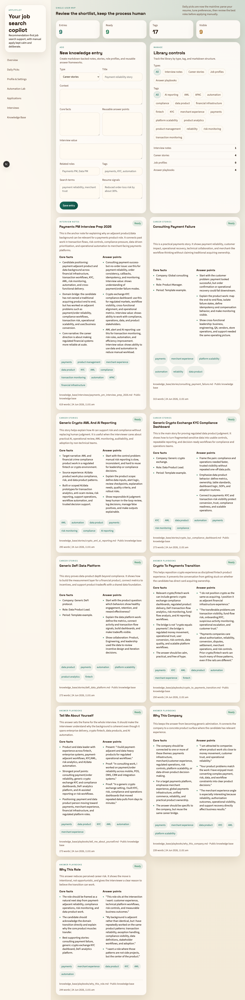
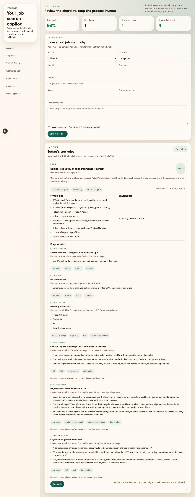
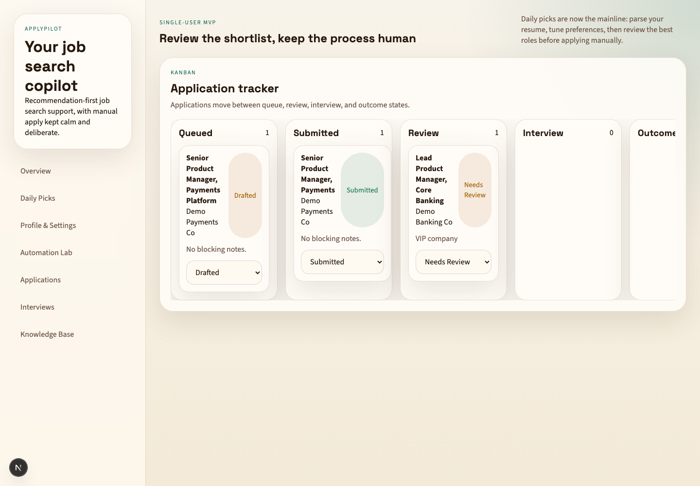
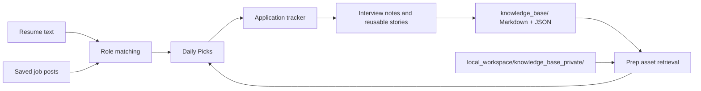

<div align="center">

# ApplyPilot

**A local-first AI job-search cockpit for matching roles, retrieving career stories, and tracking applications.**

ApplyPilot turns a resume, a sanitized local knowledge base, and saved job posts into a daily shortlist with concrete prep assets: resume evidence, reusable stories, answer playbooks, and tracker records.

[](https://www.typescriptlang.org/)
[](https://nextjs.org/)
[](https://developer.chrome.com/docs/extensions/mv3/intro/)
[](https://supabase.com/)
[](https://pnpm.io/)
[](#verification)

</div>

---

## Why It Exists

Most job-search tools stop at keyword matching or blind auto-apply. ApplyPilot is built for the slower, more useful middle layer: deciding which roles are worth attention, finding the strongest evidence for each role, and keeping the application pipeline organized without leaking private notes into Git.

This version moves the center of gravity from browser automation alone to the part that can be reliable every day: local knowledge ingestion, retrieval, scoring, prep assets, and tracker sync. The LinkedIn/MyCareersFuture extension remains an assisted apply layer, while the core product now works as a usable job-search cockpit even when no external services are configured.

The product is intentionally single-user and local-first:

- Public-safe career stories live in `knowledge_base/`.
- Private interview notes can live in `local_workspace/knowledge_base_private/`, which is ignored by Git.
- The app works with an in-memory demo store by default, so it runs without Supabase or OpenAI.
- AI calls have deterministic fallbacks, keeping the workflow usable without external services.

## Product Tour

| Knowledge base | Daily picks | Application tracker |
| --- | --- | --- |
|  |  |  |

## What It Does

| Capability | What it means |
| --- | --- |
| Role matching V0 | Scores saved jobs against profile, preferences, keywords, skills, region, salary, remote policy, and application friction. |
| Resume and story retrieval | Retrieves resume evidence plus reusable stories, interview notes, job profiles, and answer playbooks for a role. |
| Local Markdown/JSON knowledge base | Reads structured Markdown, JSON sidecars, standalone JSON entries, and private local-only entries. |
| Daily Picks | Ranks saved jobs and attaches prep assets under each role so review starts with evidence, not a blank page. |
| Application tracker sync | Manual job saves create `drafted` tracker records, and repeat saves do not reset existing statuses. |
| Human-in-the-loop automation | The Chrome extension can assist LinkedIn and MyCareersFuture flows, while risky cases route to review. |

## Core Workflow



1. Upload or parse a resume and confirm job preferences.
2. Save a real job into the pool from the Daily Picks page.
3. ApplyPilot scores the role and retrieves relevant evidence from resume text and the local knowledge base.
4. The job appears in Daily Picks with `Prep assets`.
5. The same saved job is synced into Application tracker as a `drafted` application record.

See [docs/demo-flow.md](docs/demo-flow.md) for a reproducible local demo.

## Knowledge Base

ApplyPilot reads public-safe entries from:

```text
knowledge_base/
├── interviews/
├── job_profiles/
├── playbooks/
└── stories/
```

It also reads private local entries from:

```text
local_workspace/knowledge_base_private/
```

Markdown entries use this structure:

```md
# Title

## Context

## Core facts

## Interview value

## Reusable answer points

## Related roles

## Tags
```

JSON sidecars and standalone JSON entries can add structured retrieval fields such as `searchTerms` and `resumeSignals`. Details are documented in [knowledge_base/README.md](knowledge_base/README.md).

## Architecture

```text
applypilot/
├── apps/
│   ├── web/          Next.js dashboard and API routes
│   └── extension/    Chrome MV3 extension for assisted apply flows
├── packages/
│   ├── domain/       Zod schemas, scoring, review routing, pure helpers
│   ├── ui/           Shared React primitives
│   └── config/       Environment validation
├── knowledge_base/   Public-safe Markdown/JSON career knowledge
├── local_workspace/  Private local-only notes, ignored by Git
├── tests/            Unit and integration tests
└── supabase/         Optional Postgres schema
```

Design choices:

- Keep domain logic framework-agnostic and testable.
- Prefer local Markdown/JSON for early knowledge-base features.
- Treat public and private knowledge folders differently by default.
- Preserve application status when a saved job is refreshed.
- Keep automation assisted and reviewable instead of fire-and-forget.

## Quick Start

```bash
# Prereqs: Node 22 and pnpm
pnpm install

# Run the dashboard and API
pnpm dev:web

# Optional: build the Chrome extension in watch mode
pnpm dev:extension
```

Open [http://localhost:3000](http://localhost:3000).

For a persistent database-backed setup, copy `.env.example` to `.env.local`, fill in Supabase/OpenAI values as needed, and apply the SQL migrations under `supabase/migrations/`.

## Verification

```bash
pnpm test    # 20 tests covering scoring, KB parsing/retrieval, tracker sync, store behavior
pnpm build   # production build for all workspace packages
pnpm lint    # typecheck and lint
```

The current portfolio packaging lives on `codex/resume-story-search`.

## Privacy Boundary

Commit only sanitized, reusable material under `knowledge_base/`. Keep private recruiter details, interview schedules, exact compensation expectations, personal documents, local resume paths, and sensitive application notes under `local_workspace/knowledge_base_private/`.

`local_workspace/` is ignored by Git.

## Project Status

This is a complete portfolio-ready V0 of the knowledge-backed job-search workflow:

- Match saved jobs.
- Retrieve resume evidence and career-story assets.
- Attach prep assets to Daily Picks.
- Sync saved jobs into Application tracker.
- Keep public and private knowledge separated.

The next logical branch is `codex/application-workflow-v0`, which would add an end-to-end application prep packet: selected evidence, tailored resume draft, cover note/checklist, and application detail timeline.

---

<div align="center">
<sub>Built as a practical AI product exercise: local knowledge ingestion -> retrieval -> role matching -> application tracking -> human review.</sub>
</div>
